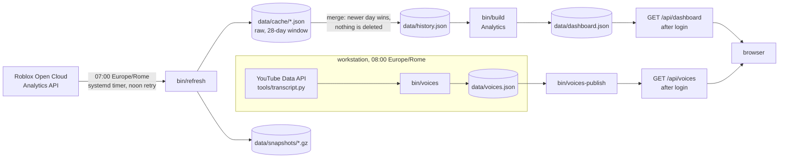
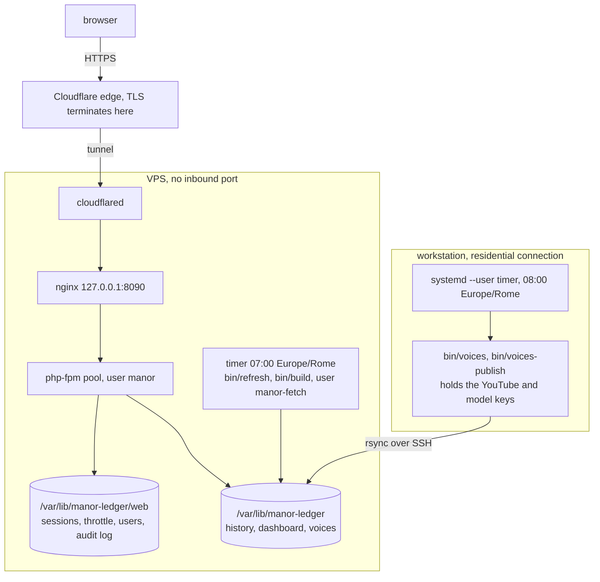

# Architecture

Manor Ledger is a small, dependency-free PHP 8.2+ application that turns the
Roblox Open Cloud Analytics API into a curated analytics dashboard for the
experience **The Locust's Manor**. It is deliberately simple: one language,
one process model (cron + php-fpm), one JSON-on-disk storage layer.

The decisions behind this shape, with the alternatives rejected and the
measurements behind them, are in [DESIGN-DECISIONS.md](DESIGN-DECISIONS.md).

## Data flow



Pages are **never** rendered from live Roblox calls. The browser only ever
receives the pre-computed `dashboard.json`, after login.

## Where it runs



The two service accounts and the separate `web/` directory are explained in
[DEPLOY.md](DEPLOY.md) and in decision 5 of
[DESIGN-DECISIONS.md](DESIGN-DECISIONS.md).

## Directory layout

| Path | Role |
|---|---|
| `bin/` | CLI entry points (`refresh`, `build`, `user`, `serve`). Thin: parse args, call `src/`. |
| `config/` | `metrics.json` (catalog), `dimensions.json` (metric × dimension pairs), `glossary.json`, `app.php` (settings + env overrides). |
| `src/ManorLedger/` | PSR-4 code, namespace `ManorLedger\`. No framework. |
| `public/` | The **only** web root. `index.php` front controller + static assets. |
| `templates/` | PHP templates (login, layout). All output escaped with `e()`. |
| `tests/` | PHPUnit. Pure-PHP units, no network. |
| `deploy/` | nginx site, php-fpm pool, cron, install script for the VPS. |
| `data/` | **git-ignored** runtime state: `cache/`, `history.json`, `dashboard.json`, `users.json`, `api-key`. |

Namespaces map to folders:

- `ManorLedger\Roblox` – `AnalyticsClient`, `RateBudget`, `MetricCatalog`
- `ManorLedger\Storage` – `JsonStore` (atomic write + flock), `History`, `Snapshots`
- `ManorLedger\Analytics` – `Series`, `Economics`, `Seasonality`, `Anomalies`, `DashboardBuilder`
- `ManorLedger\Voices` – `YouTubeClient`, `CommentFilter`, `TranscriptFetcher`, `ThumbnailStore`, `LlmClient`, `VideoSummarizer`, `Synthesizer`, `VoicesBuilder` (runs on the workstation, publishes `data/voices.json`)
- `ManorLedger\Auth` – `PasswordHasher`, `UserStore`, `Session`, `Csrf`, `LoginThrottle`, `Totp`
- `ManorLedger\Http` – `Request`, `Response`, `Router`, `SecurityHeaders`, controllers
- `ManorLedger\Support` – `Config`, `Clock`, `Paths`

Coding conventions: `declare(strict_types=1)` everywhere, `final` classes,
constructor injection, no globals, no `static` state, English identifiers and
comments. Comments explain *why*, not *what*. UI copy is Italian (its users are).

## Data contracts

### `data/cache/metrics.json` (raw, written by `bin/refresh`)

Unchanged shape from the original proxy so old snapshots stay readable:

```json
{ "fetchedAt": 1789533904,
  "results": { "<MetricId>": {
      "status": "ok" | "empty" | "error" | "ratelimited",
      "granularity": "OneDay", "days": 30, "breakdown": "Platform" | null,
      "startTime": "...Z", "endTime": "...Z",
      "series": [ { "label": "Phone", "total": 123.0,
                    "points": [ { "t": "2026-09-14T00:00:00+00:00", "v": 34565 } ] } ] } } }
```

`data/cache/dimensions.json` has the same shape, keyed `"<MetricId>|<Dimension>"`.

### `data/history.json` (incremental, written by `History::merge`)

The Roblox API keeps only 28 days for most metrics. `History` folds every
refresh into a long-lived file keyed by day, so the dashboard grows a real
time series over months. Keys are `metricId`, then series label (`""` for the
aggregate series), then ISO date `YYYY-MM-DD` (daily granularity only).

```json
{ "version": 1,
  "updatedAt": "2026-09-16T05:02:11Z",
  "metrics": {
    "ItemMonetizationRevenue": {
      "unit": "robux",
      "series": { "": { "2026-08-17": 120411, "2026-08-18": 118002 } } },
    "DailyRevenue": {
      "unit": "robux",
      "series": { "Phone": { "2026-08-17": 4 }, "Computer": { "2026-08-17": 2 } } } } }
```

Merge rules (these are what make the cache *incremental*):

1. A newer fetch **overwrites** an existing day. Roblox revises the most
   recent day upward (~+5% for revenue), so the latest value is always the
   best one.
2. Days absent from the new fetch are **kept**. Nothing is ever deleted.
3. `"status" != "ok"` results are ignored (they carry no points).
4. Hourly-granularity metrics are skipped (the dashboard is daily).

Dimension pairs are merged into the same file under the key
`"<MetricId>|<Dimension>"`.

### `data/dashboard.json` (derived, written by `bin/build`, read by the browser)

```json
{
  "generatedAt": "2026-09-16T05:03:00Z",
  "dataThrough": "2026-09-14",              // last complete (non-provisional) day
  "provisionalDate": "2026-09-15" | null,   // day Roblox will still revise
  "coverage": { "from": "2026-08-09", "to": "2026-09-15", "days": 38, "fetchedAt": 1789533904 },
  "game": { "name": "The Locust's Manor", "universeId": 10674300622 },
  "assumptions": {
    "devexUsdPerRobux": 0.0038, "royaltyShare": 0.17,
    "multiples": { "conservative": 18, "base": 30 },
    "plateauShares": [0.06, 0.10, 0.15],
    "notes": "DevEx rate: Roblox Developer Exchange, Sept 2026 ..."
  },
  "kpis": {
    // {value, delta, deltaLabel} — delta compares the last complete 7-day window
    // with the 7 days before it
    "revenue7dRobux":        { "value": 138038.14, "delta": -0.2859, "deltaLabel": "vs 7 giorni prima" },
    "revenue7dUsdNet":       { "value": 435.37,    "delta": -0.2859 },
    "dau7":                  { "value": 556393,    "delta": -0.3468 },   // integer
    "arpdau7Robux":          { "value": 0.2427,    "delta": 0.088 },
    "payingCvr7":            { "value": 0.0044,    "delta": -0.02 },
    "stickiness7":           { "value": 0.0694,    "delta": -0.6541 },
    // {value} only
    "monthlyRunRateUsdNet":  { "value": 13061.17 },
    "valuationBaseUsd":      { "value": 391835.07 },
    "valuationConservativeUsd": { "value": 235101.04 },
    "cumulativeUsdNet":      { "value": 8394.68 },
    // {value, date} — freshest cohort, NOT a window: no delta, label with its date
    "d1Retention":           { "value": 0.0710, "date": "2026-09-13" },
    "d7Retention":           { "value": 0.0136, "date": "2026-09-07" }
  },
  "metrics": {                               // every daily metric with data, from history
    "ItemMonetizationRevenue": {
      "unit": "robux", "name": "Ricavi da vendite", "en": "Item revenue",
      "category": "Monetization", "desc": "…", "breakdown": null,
      "dates": ["2026-08-17", "…"],          // full calendar: gaps are explicit nulls
      "series": [ { "label": "", "values": [120411, 118002, null] } ] },
    "DailyActiveUsers": {
      "unit": "int", "…": "…",
      "aggregatedFromBreakdown": true,       // Roblox only returned a breakdown…
      "aggregation": "sum" | "weightedMean", // …so the "" series was computed here
      "series": [ { "label": "", "values": [] }, { "label": "Phone", "values": [] } ] } },
  "dimensions": {                            // selected metric×dimension pairs
    "DailyActiveUsers|Platform": {
      "metric": "DailyActiveUsers", "dimension": "Platform", "name": "…",
      "category": "Engagement", "unit": "int",
      "dates": [], "series": [ { "label": "Phone", "values": [] } ] } },
  "derived": {                               // computed series, same {dates, series[]} shape
    "revenueUsdNet":        { "unit": "usd",   "dates": [], "series": [ {"label": "", "values": []} ] },
    "revenueUsdGross":      { "unit": "usd",   "dates": [], "series": [ … ] },
    "revenue7dAvgRobux":    { "unit": "robux", "dates": [], "series": [ … ] },
    "revenueCumulativeUsdNet": { "unit": "usd", "dates": [], "series": [ … ] },
    "valuationUsd":         { "unit": "usd",   "dates": [],
                              "series": [ {"label": "conservative", "values": []}, {"label": "base", "values": []} ] },
    "arpdauRobux":          { "unit": "robux", "dates": [], "series": [ … ] },
    "arppuRobux":           { "unit": "robux", "dates": [], "series": [ … ] },
    "dauMauStickiness":     { "unit": "pct",   "dates": [], "series": [ … ] },
    "revenuePlatformShare": { "unit": "pct",   "dates": [], "series": [ {"label": "Phone", "…": "…"} ] }
  },
  "weekOverWeek": [                          // same-weekday comparison, last 8 days
    { "date": "2026-09-14", "weekday": "dom", "revenue": 118000, "revenuePrev": 121000,
      "delta": -0.025, "dau": 70000, "arpdau": 1.69, "provisional": false } ],
  "seasonality": {                           // weekday index, 1.0 = overall mean
    "weekdays": ["lun","mar","mer","gio","ven","sab","dom"],
    "revenueIndex": [1.25,0.64,0.71,0.68,0.71,1.31,1.69], "dauIndex": [],
    "weeks": 4, "through": "2026-09-14" },
  "sessionSurvival": {                       // in-session survival curve; null when the metric is absent
    "bucketsSeconds": [0, 30, 60, "…", 1800],           // SessionTimeBucket labels, in seconds, ascending
    "current":  { "from": "2026-09-08", "to": "2026-09-14", "days": 7,
                  "values": [1.0, 0.8845, 0.8065, "…"] },  // survival at each bucket, days pooled
    "previous": { "from": "2026-09-01", "to": "2026-09-07", "days": 7, "values": [] },
    "sessionsPerDay": 367171.14,             // mean 0-second bucket over the current window
    "milestones": [                          // one entry per threshold, each with its own daily series
      { "seconds": 60, "label": "1 minuto", "current": 0.8065, "previous": 0.7778, "delta": 0.0287,
        "dates": ["2026-08-17"], "values": [0.7069] } ],
    "medianSeconds": 265.5                   // interpolated bucket where the current curve crosses 0.5
  },
  "anomalies": [                             // robust z-score vs same-weekday baseline
    { "metric": "ClientCrashRate15m", "name": "Crash rate client", "label": "",
      "date": "2026-09-14", "value": 0.031, "expected": 0.019, "zScore": 3.38,
      "direction": "up", "bad": true, "severity": "medium" | "high",
      "method": "weekday" | "median14",
      "message": "Crash rate client 1,6x sopra la baseline dello stesso giorno della settimana" } ],
  "platformValuation": [                     // plateau scenarios
    { "share": 0.06, "dau": 42137, "monthlyUsdNet": 6000, "valuationUsd": 108000 } ],
  "glossary": [ { "term": "ARPDAU", "meaning": "…" } ]
}
```

Units: `robux`, `usd`, `int`, `dec`, `pct` (0–1 fraction), `min`, `sec`, `ms`,
`hours`, `fps`, `bytes`, `mb`. Rounding: USD and Robux to 2 decimals, ARPDAU to
4, ratios to 4.

Three rules the frontend must honour:

1. **Missing days are `null`, never `0`.** `dates` spans the full calendar
   between the first and last day, so a gap in the source is visible as a hole
   rather than a straight line across it.
2. **The provisional day is present in per-day series but absent from windowed
   ones.** `revenueUsdNet`, `revenueUsdGross`, `revenueCumulativeUsdNet`,
   `arpdauRobux` and `arppuRobux` include it; `revenue7dAvgRobux` and
   `valuationUsd` stop at `dataThrough`. Series lengths therefore differ by one:
   align on dates, not on index.
3. **`bad` is not `direction`.** A fall in crash rate is reported with
   `direction: "down"` and `bad: false`. Colour by `bad`, so a good surprise
   does not look like an incident.

`sessionSurvival` windows only count days whose 0-second bucket is present
and non-zero, and need three of them: `current`, `previous` and
`medianSeconds` are `null` below that, and the whole key is `null` when
`TotalSessionsEndedInBucket` was never collected. Days after `dataThrough`
are ignored.

Any value can be `null`, including a whole KPI. `ItemMonetizationRevenue|Platform`
is not collected, and the country breakdown is already reduced to the top eight
plus a bucket labelled `"Altri"`.

### `data/voices.json` (written by `bin/voices` on the workstation, served by `GET /api/voices`)

One `bin/voices` run, for a single video:

```mermaid
sequenceDiagram
  participant B as VoicesBuilder
  participant Y as YouTubeClient
  participant F as CommentFilter
  participant T as TranscriptFetcher
  participant P as tools/transcript.py
  participant S as VideoSummarizer
  participant M as LlmClient
  B->>Y: comments(id)
  Y-->>B: raw comments
  B->>F: filter(comments)
  F-->>B: kept; chatter aimed at the creator dropped
  B->>T: fetch(id)
  T->>P: proc_open, 60 s timeout
  P-->>T: status, language, text
  alt ok or missing, a property of the video
    T->>T: cache the answer on disk
  else error or blocked, a property of the moment
    T->>T: retry, never cache
  end
  T-->>B: transcript
  B->>S: summarize(video, transcript, comments)
  S->>S: cached summary? then no model call at all
  S->>M: json(summary profile, fenced prompt)
  M->>M: retries on 429/5xx, then the fallback profile
  M-->>S: JSON answer
  S->>S: shape, length caps, Italian check with one rewrite
  alt the transcript was permanent
    S->>S: write data/voices-cache/ID.json
  else the transcript failed transiently
    S-->>B: summary returned, not cached
  end
  Note over B,M: once per run, Synthesizer makes the single synthesis call
```

The contract, the reasons behind it and the field measurements that shaped it
are in [PLAN-voices.md](PLAN-voices.md) §8. Thumbnails are served by
`GET /media/yt/{id}.jpg` after the id is validated against `^[A-Za-z0-9_-]{11}$`;
both routes require a session and are `Cache-Control: private`.

## Authentication model

Single-tenant, file-backed, read-only dashboard. There is **no** mutating
endpoint other than `POST /login` and `POST /logout`, so the attack surface is
the login form and the session cookie.

```mermaid
sequenceDiagram
  participant B as Browser
  participant N as nginx
  participant C as LoginController
  participant A as Authenticator
  participant X as Csrf
  participant T as LoginThrottle
  participant U as UserStore
  participant H as PasswordHasher
  participant S as Session
  participant L as AuditLog
  B->>N: POST /login
  N->>C: fastcgi; limit_req 10r/m, else 429
  C->>X: sameOrigin(request), validate(_csrf)
  X-->>C: either failing is the same 403
  C->>A: attempt(username, password, ip)
  A->>T: check(ip, username)
  T-->>A: locked, or free to continue
  A->>U: find(username)
  U-->>A: record, or null
  A->>H: verify(password, hash or dummy hash)
  H-->>A: same cost when the user does not exist
  opt the user has a TOTP secret
    A->>S: park the username for 5 minutes
    B->>C: POST /login with the code
    A->>A: Totp::verify, step above the last accepted one
  end
  A->>S: login(user), session id regenerated
  A->>L: login.ok with user, ip, role
  C-->>B: 302 /
```

- Passwords: `password_hash(PASSWORD_ARGON2ID)` (memory 64 MiB, time 4,
  threads 1); bcrypt fallback only when the runtime lacks argon2 (tests log a
  warning). Verification is constant-time and always runs a hash even for an
  unknown user (no username enumeration by timing).
- Sessions: PHP native sessions, `use_strict_mode`, cookie `HttpOnly; Secure;
  SameSite=Strict; Path=/`, `__Host-` prefix, id regenerated on login, idle
  timeout 30 min, absolute lifetime 12 h, bound to user agent hash.
- CSRF: per-session random token, compared with `hash_equals`, required on
  every POST. `Origin`/`Referer` must match the configured host.
- Throttling: `LoginThrottle` keeps per-IP and per-username counters in
  `data/throttle/` (flock). 5 failures → 15 min lockout, exponential.
  Client IP is `CF-Connecting-IP` **only** when `REMOTE_ADDR` is loopback
  (the request came through cloudflared), else `REMOTE_ADDR`.
- Optional TOTP (RFC 6238, SHA-1, 6 digits, 30 s, ±1 step) per user.
- Security headers on every response: strict CSP (`default-src 'none';
  script-src 'self'; style-src 'self'; img-src 'self' data:; connect-src
  'self'; frame-ancestors 'none'; base-uri 'none'; form-action 'self'`),
  HSTS, `X-Content-Type-Options`, `Referrer-Policy: same-origin` (Firefox
  omits `Origin` on same-origin form posts, and `no-referrer` then left the
  CSRF check with nothing to compare),
  `Permissions-Policy`, `Cross-Origin-Opener-Policy`.
- Audit log: `data/auth.log` — timestamp, event, username, IP. No secrets.

Users are managed only from the CLI (`bin/user add|passwd|totp|rm|list`).
